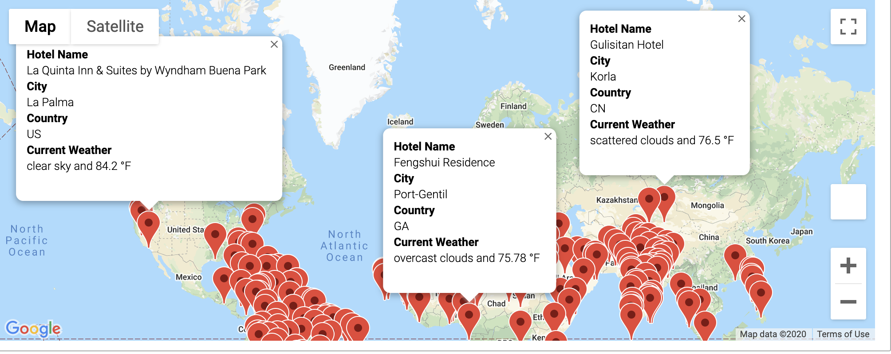
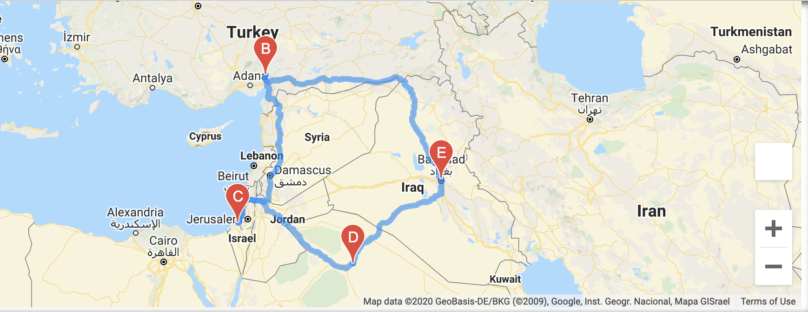
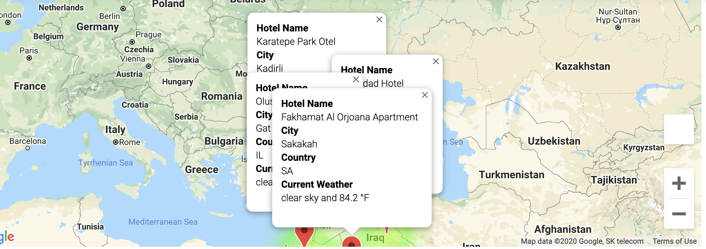

# World_Weather_Analysis

## Resources:
- Data Source: WeatherPy_Database.csv, WeatherPy_vacation.csv
- Software: anaconda3, python, jupyter notebook
- Library: matplotlib, matplotlib.pyplots, gmaps, gmaps.datasets, pandas, numpy, citipy, datetime, requests, and scipy
- APIs: Google Directions, Nearby Search, and open weather map.

## Module Project Overview
While working on this project, I used various API libraries, in order to obtain desired minimum and maximum temperatures from user and populate a list of cities that fir the temperature parameters. After that, we displayed world map along with heat map layer and city markers added to it. That data will be the foundation of the further work.

## Challenge Overview

As part of this project the following tasks are to be accomplished.

- A weather database is created that holds around 500 - 700 cities with weather information
- Select cities out of it based on user temperature preference (min, and max).
- Create a heat map wtih city markers and a hotel for each city.
- Select 4 cities user wants to go on vacation and create a route, where start and end are the same city.
    - Show the markers with the
    - Hotel name
    - City
    - Country
    - Current Weather information.

